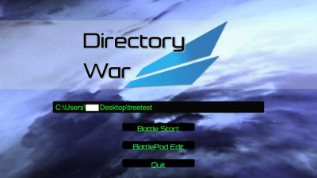
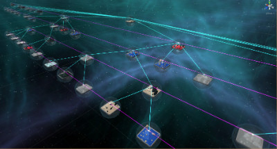
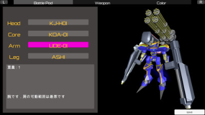

# Directory War
ディレクトリを舞台にしたロボットシューティングです。某コンテストに出しました。

配布予定はありません

[動画(YouTube)](https://www.youtube.com/watch?v=85nIXDm9VNU)

<figure>

<figcaption>タイトル画面。ここでディレクトリのパス指定</figcaption>
</figure>

<figure>

<figcaption>ディレクトリの可視化。Reingold Tilford法というレイアウトアルゴリズムを使用しています。</figcaption>
</figure>

<figure>

<figcaption>戦闘機に乗ってフィールドを高速移動</figcaption>
</figure>

<figure>

<figcaption>戦闘画面1</figcaption>
</figure>

<figure>

<figcaption>戦闘画面2</figcaption>
</figure>

<figure>

<figcaption>機体のカスタマイズもできます</figcaption>
</figure>

