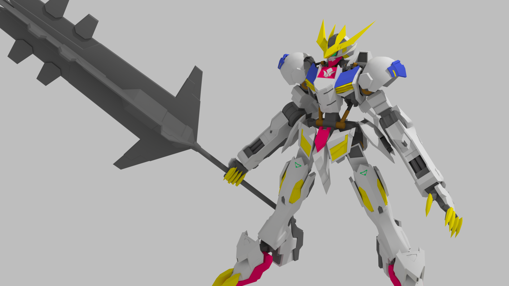
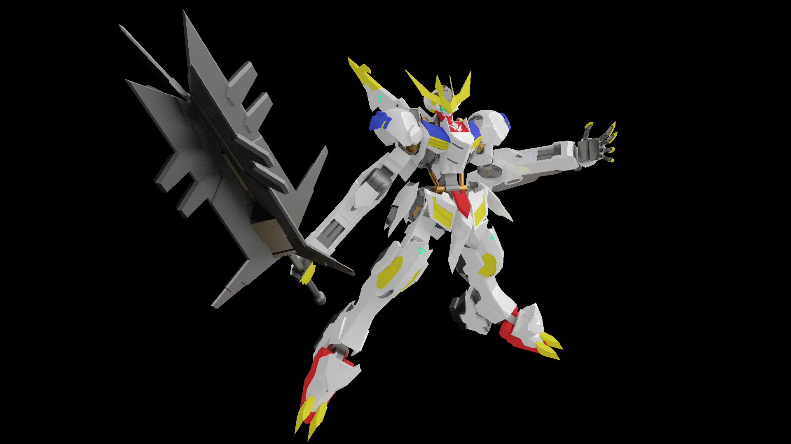
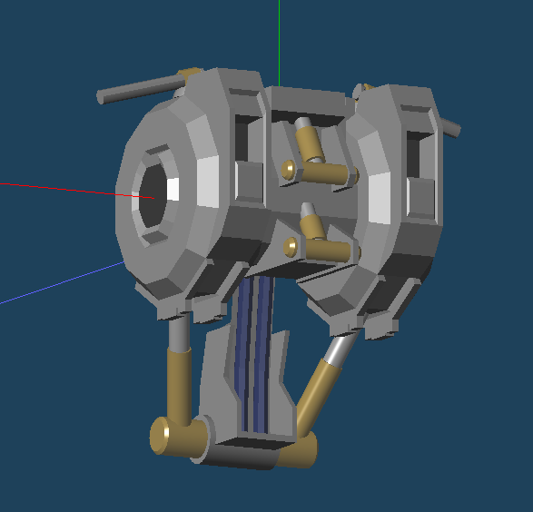
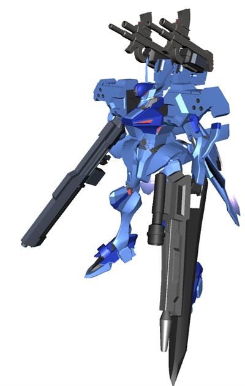
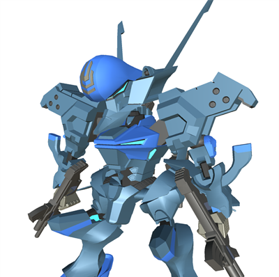
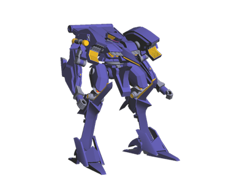
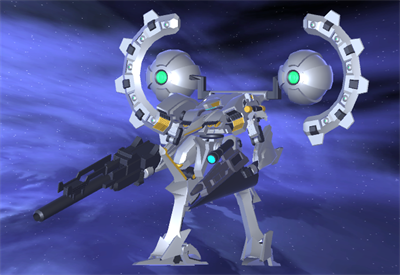

# 版権もののモデリング一覧
元ネタありのモデリング。

## ガンダムバルバトスルプスレクス
2017/07/16

「機動戦士ガンダム 鉄血のオルフェンズ」の主人公の最後の機体です．
このモデルから，Metasequoiaでモデリング→Blenderでレンダリング，という流れに

恋ダンスを躍らせたりした→ [動画(YouTube)](https://www.youtube.com/watch?v=Y7CHIxtBzyA)

<figure>

<figcaption>初めてのBlenderを使ったレンダリング</figcaption>
</figure>

<figure>

<figcaption> </figcaption>
</figure>

<figure>

<figcaption>内部フレームも作りましたが全然外から見えない</figcaption>
</figure>

## 不知火
「マブラヴ オルタネイティヴ」より戦術機の不知火です
武装が違うのは，ゲーム作成していたときに，武装をカスタマイズした結果だからです．

SD化してTwitterのアイコンに使用したりもしてます

## 03-AALIYAH
「アーマードコア4」の機体 03-AALIYAHです。
細部が違うのは技術力不足です。

背中の武装はアサルトキャノンをオマージュしたオリジナル武装です。

