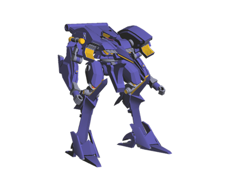
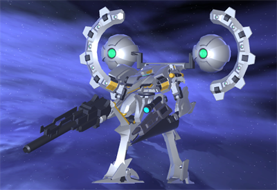
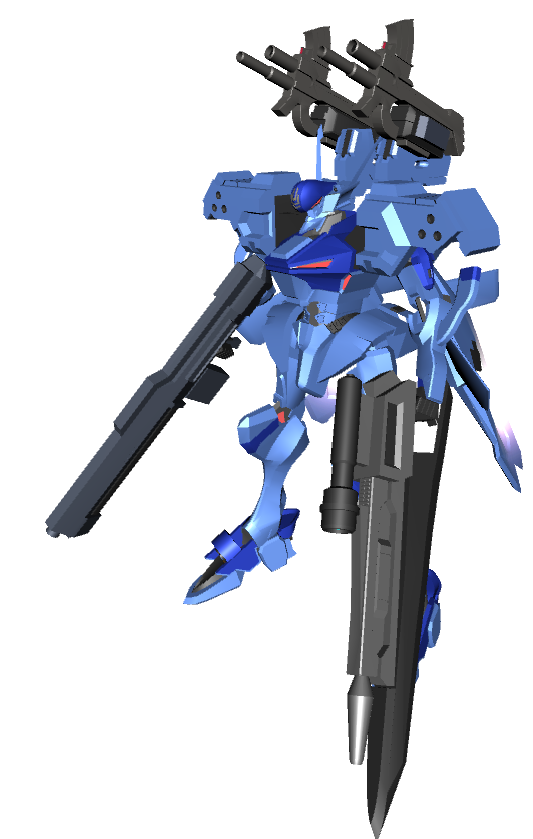
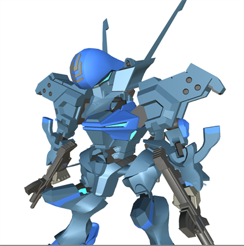

# 版権もののモデリング一覧
元ネタありのモデリング。

## 03-AALIYAH
「アーマードコア4」の機体 03-AALIYAHです。
細部が違うのは技術力不足です。

背中の武装はアサルトキャノンをオマージュしたオリジナル武装です。

## 不知火
「マブラヴ オルタネイティヴ」より戦術機の不知火です
武装が違うのは，ゲーム作成していたときに，武装をカスタマイズした結果だからです．

SD化してTwitterのアイコンに使用したりもしてます

# [TOPに戻る](index.md)
