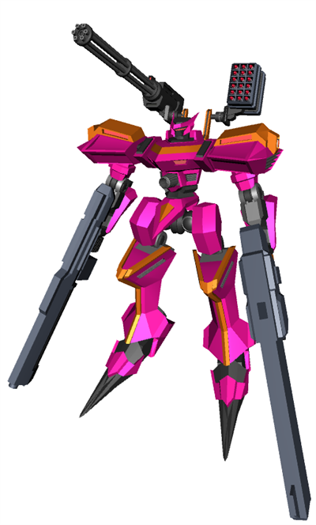
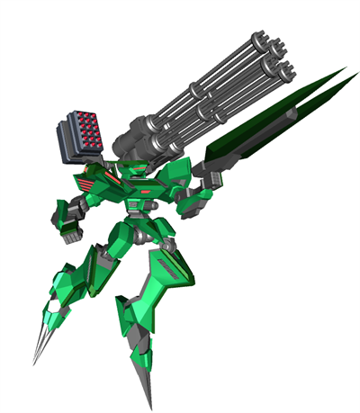
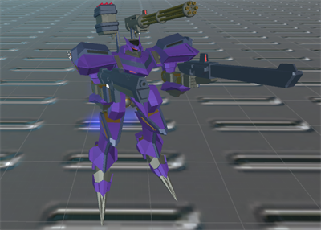
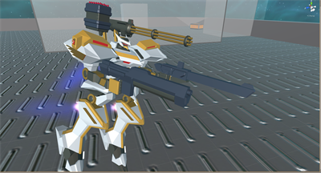
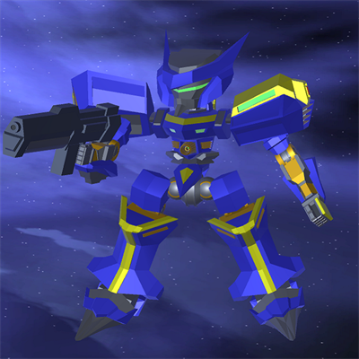
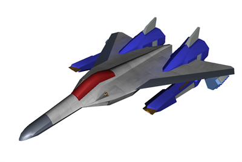

# オリジナルデザインのモデリング一覧
自分で考えて作ったけど、デザイン力って大事だなと思っています

## オリジナルロボットA
アーマードコアに影響されています・・・
別に色がきまってるわけではないです。

重武装Ver

SD化。アイコン用に作成したけど背景が暗くて見えにくい・・・

## オリジナルロボットB
どちらかといえばガンダムっぽい気がする

## 戦闘機
マクロス風。変形はしない。

