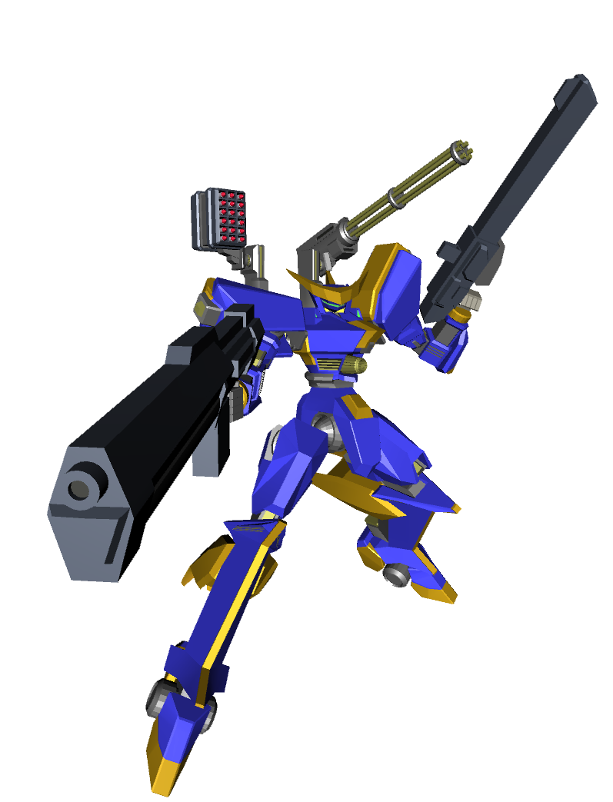
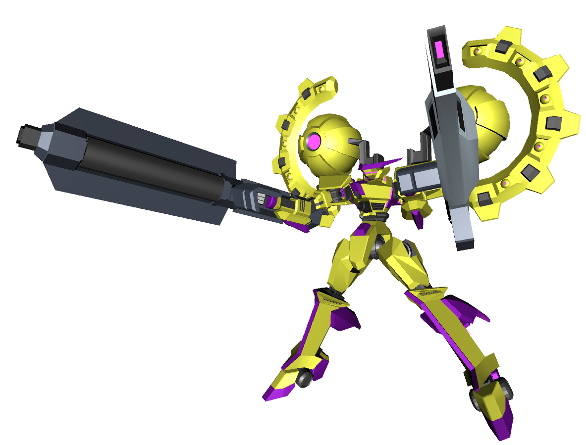
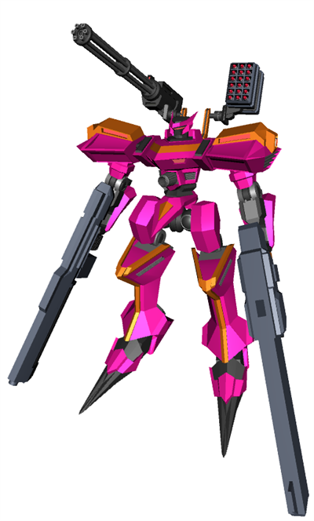
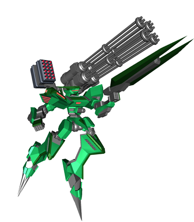
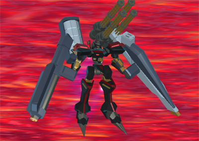
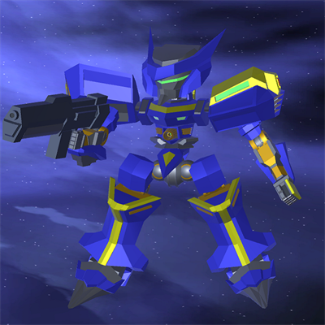
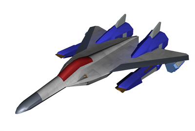

# オリジナルデザインのモデリング一覧
自分で考えて作ったけど、デザイン力って大事だなと痛感します

## オリジナルロボット2
どちらかといえばガンダムっぽい気がする.

## オリジナルロボット1
アーマードコアに影響されています・・・
別に色がきまってるわけではないです。

重武装Ver

SD化。アイコン用に作成したけど背景が暗くて見えにくい・・・

## 戦闘機
マクロス風。変形はしない。

# [TOPに戻る](index.md)
