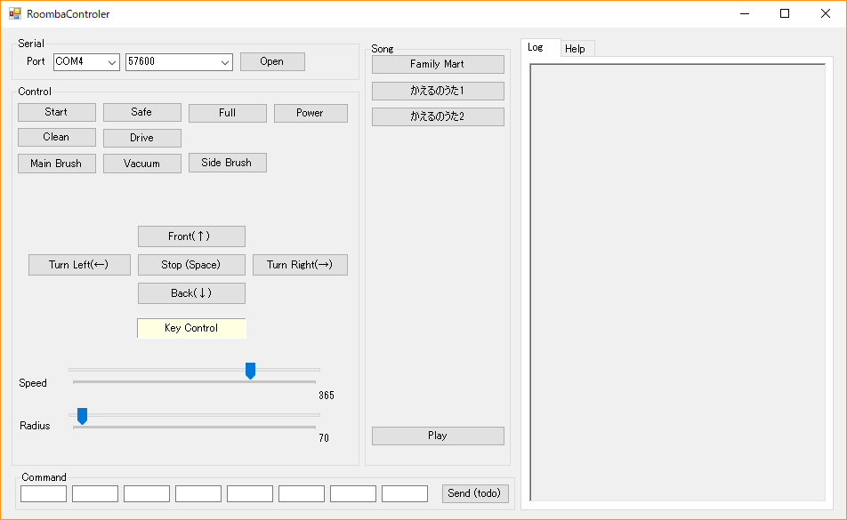
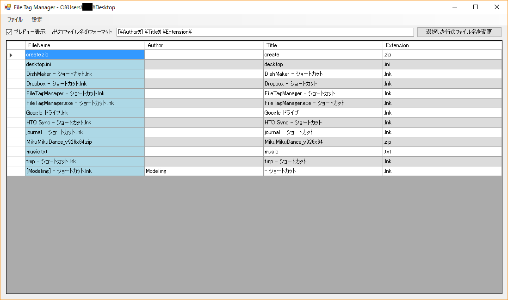
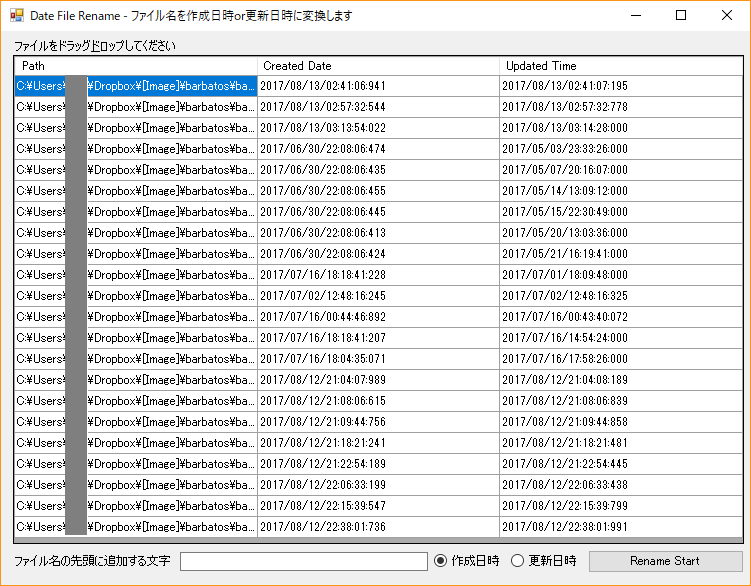

# 製作したツール類
ツールの詳しい使い方は、リンク先のReadMe.mdに記載してあります。
基本的にビルドして使用する前提です。

## [RoombaControl](https://github.com/gologius/RoombaControl)
https://github.com/gologius/RoombaControl

<figure>

<figcaption></figcaption>
</figure>

Roombaを制御するためのアプリケーション。

## [FileTagManager](https://github.com/gologius/FileTagManager)
https://github.com/gologius/FileTagManager

ZIPファイルの中の画像を見ながら，ファイル名を変更することができます．
ファイル名は正規表現を用いてタグとして抽出することができます．

<figure>

<figcaption></figcaption>
</figure>

## [DateNameRenamer](https://github.com/gologius/DateNameRenamer)
ファイル名を、作成日時または更新日時にリネームすることができます。

<figure>

<figcaption></figcaption>
</figure>

(例) 2017/08/13/02:41:07:195 -> xxx20170813024107195.png

※ xxxは任意の文字列

ファイルはD&Dで一気に選択できます。

